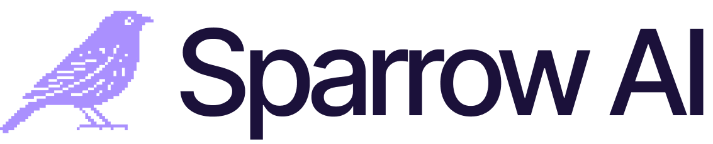

# Sparrow AI

<p align="center">
  
</p>

<p align="center">
  <strong>AI-Powered Sales Training Platform</strong><br>
  Practice sales calls with realistic AI prospects that push back like real buyers.
</p>

<p align="center">
  <a href="https://sprrw.app">
    
  </a>
  <a href="https://ai-partner-catalyst.devpost.com/">
    
  </a>
</p>

<p align="center">
  
  
  
  
  
</p>

---

## AI Partner Catalyst Hackathon Submission

**Competition:** AI Partner Catalyst: Accelerate Innovation by Google Cloud
**Partner Track:** ElevenLabs Challenge - Voice-driven Conversational AI
**Prize Pool:** $75,000

> **"Never wing a call again"**

---

## Documentation

| Document | Description |
|----------|-------------|
| [System Architecture](docs/SYSTEM_ARCHITECTURE.pdf) | Technical infrastructure and data flow diagrams |
| [ElevenLabs Integration](docs/ELEVENLABS_INTEGRATION.pdf) | Deep-dive into voice AI implementation |
| [Google Cloud Integration](docs/GOOGLE_CLOUD_INTEGRATION.pdf) | Gemini 2.0 Flash usage details |
| [Business Case](docs/BUSINESS_CASE.pdf) | Market analysis, TAM/SAM/SOM, ROI calculator |
| [Development Timeline](docs/DEVELOPMENT_TIMELINE.pdf) | 8-day build log with commit history |
| [Demo Video Script](docs/DEMO_VIDEO_SCRIPT.pdf) | 3-minute video storyboard |
| [Technical Implementation](docs/TECHNICAL_IMPLEMENTATION.pdf) | Detailed technical specifications |
| [Impact Statement](docs/IMPACT_STATEMENT.pdf) | Business and social impact analysis |
| [Project Summary](docs/PROJECT_SUMMARY.pdf) | Executive overview |

---

## The Problem

Sales teams lose millions training reps on real prospects:

| Pain Point | Impact |
|------------|--------|
| Average SDR ramp time | 3-6 months |
| Reps missing quota | **67%** |
| Manager time on roleplay | 15-20% |
| Where practice happens | On real prospects = lost deals |

## The Solution

Sparrow is an AI sparring partner that:
- Is available **24/7** (managers aren't)
- Never gets tired of roleplaying (managers do)
- Provides **consistent, objective feedback** (managers are biased)
- Creates a **safe space to fail** (real calls aren't)

---

## Features

### Three Practice Modes

| Mode | Goal | Skills Practiced |
|------|------|------------------|
| **Cold Call Simulator** | Book a meeting | Openers, gatekeepers, value props |
| **Discovery Call Simulator** | Uncover pain | Open questions, active listening |
| **Objection Gauntlet** | Handle pushback | Price, timing, competitor objections |

### Realistic AI Prospects

Each AI prospect has:
- **Unique Backstory** - Company, role, tenure, challenges
- **Hidden Pain Points** - Revealed through good discovery
- **Personality Type** - Skeptical, busy, friendly, technical
- **Specific Objections** - Tailored to role and industry

### Real-Time Scoring

- **5 skill dimensions** - Opening, Discovery, Objection Handling, Call Control, Closing
- **Timestamped feedback** - Know exactly what to improve
- **Progress tracking** - See improvement over time

### Coach Sparrow

AI coaching assistant powered by Gemini that provides personalized guidance.

---

## Tech Stack

### Core

| Technology | Version | Purpose |
|------------|---------|---------|
| Next.js | 15 | React framework with App Router |
| React | 19 | UI library |
| TypeScript | 5.7 | Type safety |
| Tailwind CSS | 4 | Styling |

### AI & Voice (Partner Integrations)

| Provider | Product | Purpose |
|----------|---------|---------|
| **ElevenLabs** | Conversational AI | Real-time voice conversations |
| **Google Cloud** | Gemini 2.0 Flash | Persona generation, deep analysis |
| **Groq** | Llama 3.3 70B | Real-time scoring (~200ms) |

### Backend

| Service | Purpose |
|---------|---------|
| Supabase | PostgreSQL database, Realtime |
| Clerk | Authentication |
| Vercel | Hosting, Edge Functions |

---

## Quick Start

### Prerequisites

- **Node.js 18+**
- **pnpm** (recommended) or npm
- API keys (see below)

### 1. Clone & Install

```bash
git clone https://github.com/brn-mwai/sparrow-ai-partner-catalyst.git
cd sparrow-ai-partner-catalyst

pnpm install
```

### 2. Environment Variables

```bash
cp .env.example .env.local
```

Fill in your `.env.local`:

```env
# App
NEXT_PUBLIC_APP_URL=http://localhost:3000

# Clerk Authentication
NEXT_PUBLIC_CLERK_PUBLISHABLE_KEY=pk_test_...
CLERK_SECRET_KEY=sk_test_...

# Supabase
NEXT_PUBLIC_SUPABASE_URL=https://xxx.supabase.co
NEXT_PUBLIC_SUPABASE_ANON_KEY=eyJ...
SUPABASE_SERVICE_ROLE_KEY=eyJ...

# ElevenLabs (Primary Partner)
ELEVENLABS_API_KEY=sk_...
NEXT_PUBLIC_ELEVENLABS_AGENT_ID=...

# Google Cloud / Gemini (Required)
GOOGLE_GENERATIVE_AI_API_KEY=...

# Groq (Fast Inference)
GROQ_API_KEY=gsk_...
```

### 3. Database Setup

Run in Supabase SQL Editor:

```sql
-- See supabase/schema.sql for complete schema
```

### 4. Run Development Server

```bash
pnpm dev
```

Open [http://localhost:3000](http://localhost:3000)

---

## API Keys Setup

### ElevenLabs (Required)

1. Go to [elevenlabs.io](https://elevenlabs.io)
2. Create account and get API key
3. Create a Conversational AI agent at [elevenlabs.io/app/conversational-ai](https://elevenlabs.io/app/conversational-ai)
4. Copy the Agent ID

### Google Cloud / Gemini (Required)

1. Go to [ai.google.dev](https://ai.google.dev)
2. Create API key for Gemini

### Supabase (Required)

1. Create project at [supabase.com](https://supabase.com)
2. Get URL and keys from Settings > API
3. Run schema from `supabase/schema.sql`

### Clerk (Required)

1. Create app at [clerk.com](https://clerk.com)
2. Get publishable and secret keys

### Groq (Required)

1. Get API key at [console.groq.com](https://console.groq.com)

---

## Project Structure

```
sparrow-ai/
├── src/
│   ├── app/                    # Next.js App Router
│   │   ├── (auth)/            # Sign in/up pages
│   │   ├── (marketing)/       # Landing page
│   │   ├── dashboard/         # Protected app
│   │   │   ├── call/[id]/    # Practice call UI
│   │   │   ├── history/      # Call history
│   │   │   ├── progress/     # Progress tracking
│   │   │   └── prospects/    # AI prospects
│   │   └── api/              # API routes
│   │       ├── calls/        # Call management
│   │       ├── personas/     # Persona generation
│   │       └── user/         # User data
│   ├── components/
│   │   ├── dashboard/        # Dashboard components
│   │   ├── landing/          # Marketing components
│   │   └── shared/           # Shared components
│   ├── lib/
│   │   ├── ai/              # Gemini + Groq clients
│   │   ├── elevenlabs/      # Voice AI client
│   │   └── supabase/        # Database client
│   └── types/               # TypeScript types
├── public/                  # Static assets
├── docs/                    # PDF documentation
└── supabase/               # Database schema
```

---

## Architecture

```
┌─────────────────────────────────────────────────────────────┐
│                         USER                                 │
│                    (Sales Rep)                               │
└─────────────────────────────────────────────────────────────┘
                            │
                            ▼
┌─────────────────────────────────────────────────────────────┐
│                    SPARROW FRONTEND                          │
│              Next.js 15 + React 19 + Tailwind               │
└─────────────────────────────────────────────────────────────┘
                            │
            ┌───────────────┼───────────────┐
            ▼               ▼               ▼
    ┌──────────────┐ ┌──────────────┐ ┌──────────────┐
    │  ELEVENLABS  │ │    GEMINI    │ │     GROQ     │
    │              │ │              │ │              │
    │ Voice AI     │ │ Personas     │ │ Fast Score   │
    │ WebSocket    │ │ Analysis     │ │ ~200ms       │
    └──────────────┘ └──────────────┘ └──────────────┘
                            │
                            ▼
              ┌──────────────────────────┐
              │        SUPABASE          │
              │  PostgreSQL + Realtime   │
              └──────────────────────────┘
```

### Call Flow

1. User selects practice mode → **Gemini** generates unique persona
2. Call starts → **ElevenLabs** handles real-time voice conversation
3. During call → **Groq** provides live coaching hints
4. Call ends → **Gemini** analyzes transcript and scores performance
5. Results saved → **Supabase** stores for progress tracking

---

## Scripts

```bash
# Development
pnpm dev              # Start dev server
pnpm build            # Production build
pnpm start            # Start production server

# Quality
pnpm lint             # Run ESLint
pnpm typecheck        # TypeScript check

# Database
pnpm db:generate      # Generate Supabase types
```

---

## Deployment

### Vercel (Recommended)

1. Push to GitHub
2. Import to [vercel.com](https://vercel.com)
3. Add environment variables
4. Deploy

### Environment Variables for Production

All variables from `.env.example` are required in production.

---

## License

MIT License - see [LICENSE](LICENSE) file.

---

## Team

**Developer:** Sparrow AI Team
**Built for:** AI Partner Catalyst Hackathon by Google Cloud
**Timeline:** 8 days (December 22-30, 2025)

---

## Links

- **Live Demo:** [sprrw.app](https://sprrw.app)
- **Hackathon:** [AI Partner Catalyst](https://ai-partner-catalyst.devpost.com/)
- **Repository:** [github.com/brn-mwai/sparrow-ai-partner-catalyst](https://github.com/brn-mwai/sparrow-ai-partner-catalyst)

---

<p align="center">
  <strong>Sparrow AI</strong><br>
  <em>Never wing a call again.</em>
</p>
