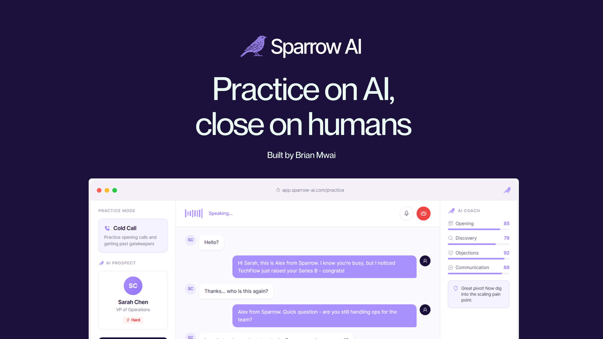

<p align="center">
  
</p>

<p align="center">
  <a href="https://sprrw.app">
    
  </a>
  <a href="https://ai-partner-catalyst.devpost.com/">
    
  </a>
</p>

<p align="center">
  
  
  
  
  
</p>

---

## AI Partner Catalyst Hackathon Submission

| | |
|---|---|
| **Competition** | AI Partner Catalyst: Accelerate Innovation by Google Cloud |
| **Partner Track** | ElevenLabs Challenge - Voice-driven Conversational AI |
| **Prize Pool** | $75,000 |
| **Live Demo** | [sprrw.app](https://sprrw.app) |

> *"Never wing a call again"*

---

## Documentation

| Document | Description |
|:---------|:------------|
| [System Architecture](docs/SYSTEM_ARCHITECTURE.pdf) | Technical infrastructure and data flow diagrams |
| [ElevenLabs Integration](docs/ELEVENLABS_INTEGRATION.pdf) | Deep-dive into voice AI implementation |
| [Google Cloud Integration](docs/GOOGLE_CLOUD_INTEGRATION.pdf) | Gemini 2.0 Flash usage details |
| [Business Case](docs/BUSINESS_CASE.pdf) | Market analysis, TAM/SAM/SOM, ROI calculator |
| [Development Timeline](docs/DEVELOPMENT_TIMELINE.pdf) | 8-day build log with commit history |
| [Technical Implementation](docs/TECHNICAL_IMPLEMENTATION.pdf) | Detailed technical specifications |
| [Impact Statement](docs/IMPACT_STATEMENT.pdf) | Business and social impact analysis |
| [Project Summary](docs/PROJECT_SUMMARY.pdf) | Executive overview |

---

## The Problem

Sales teams lose millions training reps on real prospects:

| Pain Point | Impact |
|:-----------|:-------|
| Average SDR ramp time | 3-6 months |
| Reps missing quota | **67%** |
| Manager time on roleplay | 15-20% |
| Where practice happens | On real prospects = lost deals |

## The Solution

Sparrow is an AI sparring partner that provides:

| Feature | Benefit |
|:--------|:--------|
| 24/7 Availability | Practice anytime, no scheduling needed |
| Unlimited Patience | Never gets tired of roleplaying |
| Objective Feedback | Consistent, data-driven scoring |
| Safe Environment | Fail without losing real deals |

---

## Features

### Practice Modes

| Mode | Goal | Skills Practiced |
|:-----|:-----|:-----------------|
| **Cold Call Simulator** | Book a meeting | Openers, gatekeepers, value props |
| **Discovery Call Simulator** | Uncover pain | Open questions, active listening |
| **Objection Gauntlet** | Handle pushback | Price, timing, competitor objections |

### AI Prospect Capabilities

| Feature | Description |
|:--------|:------------|
| Unique Backstory | Company, role, tenure, challenges |
| Hidden Pain Points | Revealed through good discovery |
| Personality Types | Skeptical, busy, friendly, technical |
| Dynamic Objections | Tailored to role and industry |

### Real-Time Scoring

| Dimension | What It Measures |
|:----------|:-----------------|
| Opening | First impression, attention earned |
| Discovery | Questions asked, pain uncovered |
| Objection Handling | Responses to pushback |
| Call Control | Conversation guidance |
| Closing | Next steps secured |

---

## Tech Stack

### Core Technologies

| Technology | Version | Purpose |
|:-----------|:--------|:--------|
| Next.js | 15 | React framework with App Router |
| React | 19 | UI library |
| TypeScript | 5.7 | Type safety |
| Tailwind CSS | 4 | Styling |

### AI & Voice Partners

| Provider | Product | Purpose |
|:---------|:--------|:--------|
| **ElevenLabs** | Conversational AI | Real-time voice conversations |
| **Google Cloud** | Gemini 2.0 Flash | Persona generation, analysis |
| **Groq** | Llama 3.3 70B | Real-time scoring (~200ms) |

### Backend Services

| Service | Purpose |
|:--------|:--------|
| Supabase | PostgreSQL database, Realtime |
| Clerk | Authentication |
| Vercel | Hosting, Edge Functions |

---

## System Architecture

```
                              ┌─────────────────┐
                              │   Sales Rep     │
                              │    (User)       │
                              └────────┬────────┘
                                       │
                                       ▼
                    ┌──────────────────────────────────┐
                    │         SPARROW FRONTEND         │
                    │    Next.js 15 + React 19 + TW    │
                    └──────────────────┬───────────────┘
                                       │
              ┌────────────────────────┼────────────────────────┐
              │                        │                        │
              ▼                        ▼                        ▼
    ┌─────────────────┐    ┌─────────────────┐    ┌─────────────────┐
    │   ELEVENLABS    │    │  GOOGLE GEMINI  │    │      GROQ       │
    │                 │    │                 │    │                 │
    │  Voice AI       │    │  Personas       │    │  Fast Scoring   │
    │  WebSocket      │    │  Analysis       │    │  ~200ms         │
    │  Sub-500ms      │    │  Feedback       │    │                 │
    └─────────────────┘    └─────────────────┘    └─────────────────┘
                                       │
                                       ▼
                           ┌─────────────────────┐
                           │      SUPABASE       │
                           │  PostgreSQL + RT    │
                           └─────────────────────┘
```

### Call Flow

```
┌──────────┐    ┌──────────┐    ┌──────────┐    ┌──────────┐    ┌──────────┐
│  SELECT  │───▶│ GENERATE │───▶│  START   │───▶│  SCORE   │───▶│  REVIEW  │
│   MODE   │    │  PERSONA │    │   CALL   │    │   CALL   │    │ FEEDBACK │
└──────────┘    └──────────┘    └──────────┘    └──────────┘    └──────────┘
                    │               │                │
                    ▼               ▼                ▼
               ┌─────────┐    ┌─────────┐      ┌─────────┐
               │ Gemini  │    │Eleven   │      │  Groq   │
               │ 2.0     │    │Labs     │      │ + Gemini│
               └─────────┘    └─────────┘      └─────────┘
```

---

## Quick Start

### Prerequisites

| Requirement | Version |
|:------------|:--------|
| Node.js | 18+ |
| pnpm | Latest |
| API Keys | See below |

### Installation

```bash
# Clone repository
git clone https://github.com/brn-mwai/sparrow.git
cd sparrow

# Install dependencies
pnpm install

# Copy environment file
cp .env.example .env.local

# Start development server
pnpm dev
```

### Environment Variables

```env
# App
NEXT_PUBLIC_APP_URL=http://localhost:3000

# Clerk Authentication
NEXT_PUBLIC_CLERK_PUBLISHABLE_KEY=pk_test_...
CLERK_SECRET_KEY=sk_test_...

# Supabase
NEXT_PUBLIC_SUPABASE_URL=https://xxx.supabase.co
NEXT_PUBLIC_SUPABASE_ANON_KEY=eyJ...
SUPABASE_SERVICE_ROLE_KEY=eyJ...

# ElevenLabs (Primary Partner)
ELEVENLABS_API_KEY=sk_...
NEXT_PUBLIC_ELEVENLABS_AGENT_ID=...

# Google Cloud / Gemini (Required)
GOOGLE_GENERATIVE_AI_API_KEY=...

# Groq (Fast Inference)
GROQ_API_KEY=gsk_...
```

---

## API Keys Setup

| Service | Setup Instructions |
|:--------|:-------------------|
| **ElevenLabs** | 1. Create account at [elevenlabs.io](https://elevenlabs.io)<br>2. Get API key from settings<br>3. Create Conversational AI agent<br>4. Copy Agent ID |
| **Google Gemini** | 1. Go to [ai.google.dev](https://ai.google.dev)<br>2. Create API key for Gemini |
| **Supabase** | 1. Create project at [supabase.com](https://supabase.com)<br>2. Get URL and keys from Settings > API<br>3. Run schema from `supabase/schema.sql` |
| **Clerk** | 1. Create app at [clerk.com](https://clerk.com)<br>2. Get publishable and secret keys |
| **Groq** | 1. Get API key at [console.groq.com](https://console.groq.com) |

---

## Project Structure

```
sparrow-ai/
├── src/
│   ├── app/                    # Next.js App Router
│   │   ├── (auth)/             # Sign in/up pages
│   │   ├── (marketing)/        # Landing page
│   │   ├── dashboard/          # Protected app
│   │   │   ├── call/[id]/      # Practice call UI
│   │   │   ├── history/        # Call history
│   │   │   ├── progress/       # Progress tracking
│   │   │   └── prospects/      # AI prospects
│   │   └── api/                # API routes
│   │       ├── calls/          # Call management
│   │       ├── personas/       # Persona generation
│   │       └── user/           # User data
│   ├── components/
│   │   ├── dashboard/          # Dashboard components
│   │   ├── landing/            # Marketing components
│   │   └── shared/             # Shared components
│   ├── lib/
│   │   ├── ai/                 # Gemini + Groq clients
│   │   ├── elevenlabs/         # Voice AI client
│   │   └── supabase/           # Database client
│   └── types/                  # TypeScript types
├── public/                     # Static assets
├── docs/                       # PDF documentation
└── supabase/                   # Database schema
```

---

## Scripts

| Command | Description |
|:--------|:------------|
| `pnpm dev` | Start development server |
| `pnpm build` | Production build |
| `pnpm start` | Start production server |
| `pnpm lint` | Run ESLint |
| `pnpm typecheck` | TypeScript check |
| `pnpm db:generate` | Generate Supabase types |

---

## Deployment

### Vercel (Recommended)

1. Push to GitHub
2. Import to [vercel.com](https://vercel.com)
3. Add environment variables
4. Deploy

All variables from `.env.example` are required in production.

---

## License

MIT License - see [LICENSE](LICENSE) file.

---

## Team

| | |
|---|---|
| **Developer** | Brian Mwai |
| **Hackathon** | AI Partner Catalyst by Google Cloud |
| **Timeline** | 8 days (December 22-30, 2025) |
| **Domain** | [sprrw.app](https://sprrw.app) |

---

<p align="center">
  <strong>Sparrow AI</strong><br>
  <em>Practice on AI, close on humans.</em>
</p>
