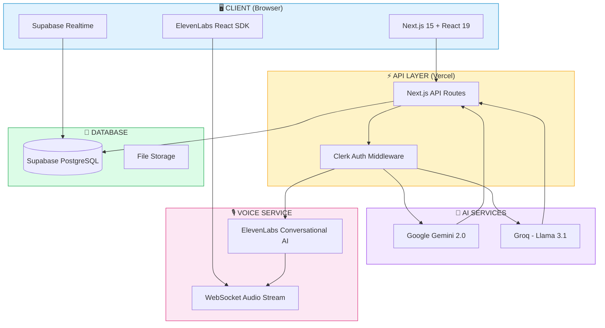
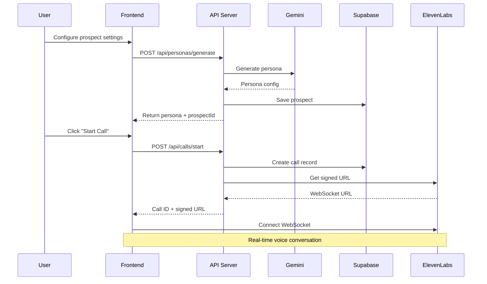
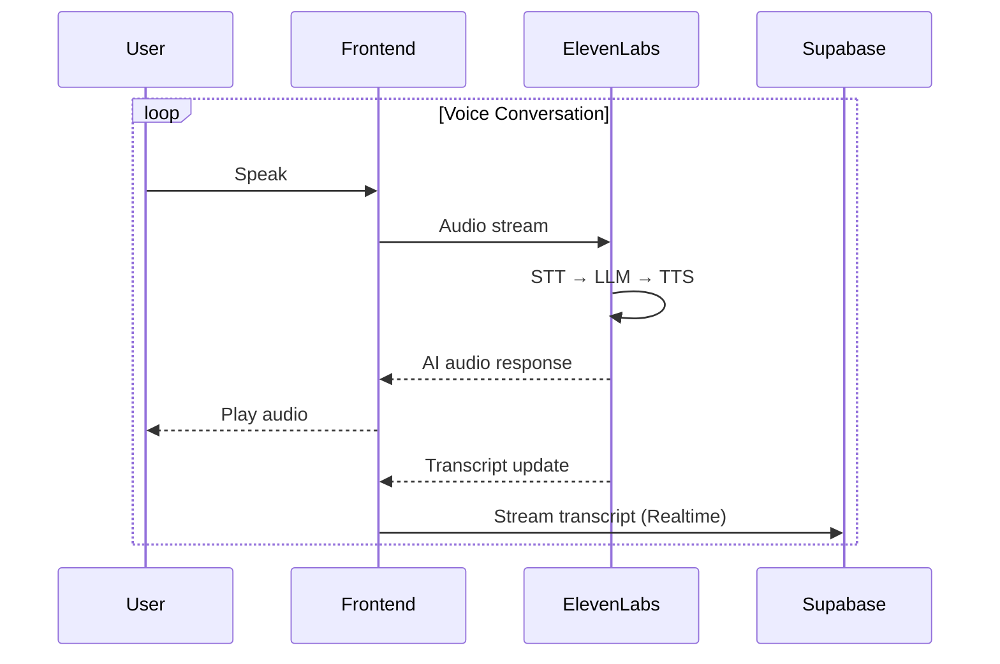
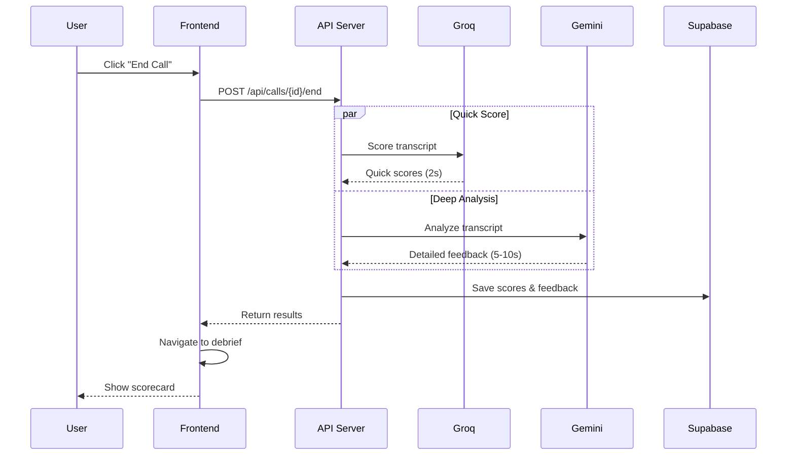
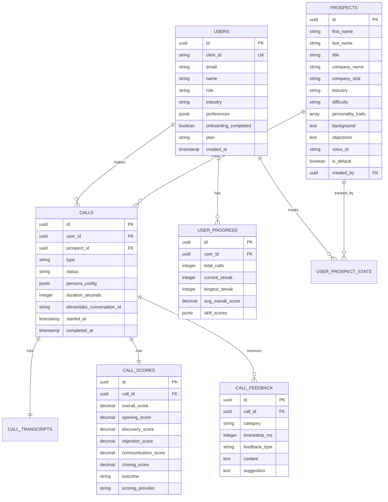

# Sparrow AI

**AI-Powered Sales Training Platform**

Practice sales calls with AI prospects that push back like real buyers. Get instant feedback, improve faster, never practice on real deals again.

[](https://sprrw.app)
[](LICENSE)
[](https://elevenlabs.io)
[](https://ai.google.dev)

---

## Table of Contents

- [Overview](#overview)
- [Features](#features)
- [System Architecture](#system-architecture)
- [Technology Stack](#technology-stack)
- [Data Flow](#data-flow)
- [Database Schema](#database-schema)
- [API Endpoints](#api-endpoints)
- [Getting Started](#getting-started)
- [Environment Variables](#environment-variables)
- [Deployment](#deployment)
- [Contributing](#contributing)
- [License](#license)

---

## Overview

Sparrow AI solves a fundamental problem in sales training: **you can't get good at sales by reading about it**. Traditional training methods (books, videos, roleplay with managers) don't prepare reps for real conversations.

### The Problem

| Challenge | Impact |
|:----------|:-------|
| 🕐 Average SDR ramp time | 3-6 months |
| 📉 Reps missing quota | 67% |
| 👔 Manager time on roleplay | 15-20% (and inconsistent) |
| ⚠️ Where practice happens | On real prospects = lost deals |

### The Solution

An AI sparring partner that:
- ✅ Is available 24/7
- ✅ Never gets tired of roleplaying
- ✅ Provides consistent, objective feedback
- ✅ Creates a safe space to fail
- ✅ Adapts difficulty based on skill level

---

## Features

### 🎯 Three Practice Modes

```
┌─────────────────────────────────────────────────────────────────────────┐
│                        PRACTICE MODES                                   │
├─────────────────────┬─────────────────────┬─────────────────────────────┤
│    COLD CALL        │     DISCOVERY       │    OBJECTION GAUNTLET       │
│    ────────────     │     ─────────       │    ─────────────────        │
│  Book meetings      │  Uncover pain       │  Handle pushback            │
│  with prospects     │  points through     │  with confidence            │
│  who weren't        │  strategic          │  through rapid-fire         │
│  expecting you      │  questioning        │  objections                 │
└─────────────────────┴─────────────────────┴─────────────────────────────┘
```

### 🤖 Realistic AI Prospects

Each AI prospect has:

| Attribute | Description |
|:----------|:------------|
| 🏢 **Backstory** | Company, role, tenure, recent challenges |
| 😣 **Hidden Pain Points** | Only revealed if user asks the right questions |
| 🎭 **Personality Type** | Skeptical, Busy, Friendly, or Technical |
| 🛡️ **Specific Objections** | Tailored to their role and industry |
| 📈 **Adaptive Behavior** | Gets harder or easier based on performance |

### 📊 Instant Scoring & Feedback

```
┌─────────────────────────────────────────────────────────────────────────┐
│                         SCORE BREAKDOWN                                 │
├─────────────────────────────────────────────────────────────────────────┤
│                                                                         │
│  Opening           ████████████████████████░░░░░░  8.1/10              │
│  Discovery         ████████████░░░░░░░░░░░░░░░░░░  6.2/10  ← Focus     │
│  Objection         ██████████████████░░░░░░░░░░░░  7.1/10              │
│  Call Control      ██████████████████░░░░░░░░░░░░  7.0/10              │
│  Closing           ████████████░░░░░░░░░░░░░░░░░░  5.4/10  ← Focus     │
│                                                                         │
│  Overall: 6.8/10                                                        │
└─────────────────────────────────────────────────────────────────────────┘
```

---

## System Architecture

### High-Level Overview



### Component Architecture

```mermaid
flowchart LR
    subgraph Pages["📄 Pages"]
        Landing[Landing Page]
        Dashboard[Dashboard]
        Practice[Practice]
        Call[Live Call]
        Debrief[Debrief]
        History[History]
        Prospects[AI Prospects]
    end

    subgraph Components["🧩 Components"]
        UI[UI Components]
        Call_UI[Call Interface]
        Score[Score Cards]
        Trans[Transcript Viewer]
    end

    subgraph Hooks["🪝 Hooks"]
        useCall[useCall]
        useAudio[useAudio]
        useRealtime[useRealtime]
    end

    subgraph Lib["📚 Libraries"]
        EL_Client[ElevenLabs Client]
        Gemini_Client[Gemini Client]
        Groq_Client[Groq Client]
        Supa_Client[Supabase Client]
    end

    Pages --> Components
    Components --> Hooks
    Hooks --> Lib

    style Pages fill:#dbeafe,stroke:#2563eb
    style Components fill:#fef9c3,stroke:#ca8a04
    style Hooks fill:#ede9fe,stroke:#7c3aed
    style Lib fill:#fee2e2,stroke:#dc2626
```



---

## Technology Stack

### Core Technologies

| Layer | Technology | Purpose |
|:------|:-----------|:--------|
| 🎨 **Frontend** | Next.js 15, React 19, TypeScript | UI Framework |
| 🎙️ **Voice AI** | ElevenLabs Conversational AI | Real-time voice interactions |
| 🧠 **AI/LLM** | Google Gemini 2.0 Flash | Persona generation, deep analysis |
| ⚡ **Fast AI** | Groq (Llama 3.1 70B) | Quick scoring (<2s response) |
| 💾 **Database** | Supabase (PostgreSQL) | Data persistence, realtime |
| 🔐 **Auth** | Clerk | User authentication |
| 🚀 **Hosting** | Vercel | Edge deployment |
| 🎨 **Styling** | Tailwind CSS, shadcn/ui | Component styling |

### Package Dependencies

```
├── next@15.x              # React framework
├── react@19.x             # UI library
├── typescript@5.7.x       # Type safety
├── @clerk/nextjs          # Authentication
├── @supabase/supabase-js  # Database client
├── @google/generative-ai  # Gemini SDK
├── groq-sdk               # Groq client
├── elevenlabs             # Voice AI SDK
├── tailwindcss@4.x        # Styling
├── framer-motion          # Animations
└── recharts               # Data visualization
```

---

## Data Flow

### Starting a Call



### During the Call



### Ending a Call & Scoring



---

## Database Schema

### Entity Relationship Diagram



### Table Details

#### Users Table

| Column | Type | Description |
|:-------|:-----|:------------|
| `id` | UUID | Primary key |
| `clerk_id` | TEXT | Clerk authentication ID |
| `email` | TEXT | User email |
| `name` | TEXT | Display name |
| `role` | TEXT | SDR, AE, Manager, Founder |
| `plan` | TEXT | free, starter, pro |
| `onboarding_completed` | BOOLEAN | Onboarding status |

#### Calls Table

| Column | Type | Description |
|:-------|:-----|:------------|
| `id` | UUID | Primary key |
| `user_id` | UUID | Foreign key to users |
| `prospect_id` | UUID | Foreign key to prospects |
| `type` | ENUM | cold_call, discovery, objection_gauntlet |
| `status` | ENUM | ready, active, completed, abandoned |
| `persona_config` | JSONB | AI-generated persona details |
| `duration_seconds` | INTEGER | Call length |

#### Call Scores Table

| Column | Type | Range | Description |
|:-------|:-----|:------|:------------|
| `overall_score` | DECIMAL | 0-10 | Weighted average |
| `opening_score` | DECIMAL | 0-10 | Hook & attention |
| `discovery_score` | DECIMAL | 0-10 | Pain uncovering |
| `objection_score` | DECIMAL | 0-10 | Handling pushback |
| `communication_score` | DECIMAL | 0-10 | Call control |
| `closing_score` | DECIMAL | 0-10 | Next steps |

---

## API Endpoints

### Authentication Required

All endpoints require Clerk authentication via `Authorization` header.

### Endpoints Overview

| Method | Endpoint | Description |
|:-------|:---------|:------------|
| `POST` | `/api/personas/generate` | Generate AI prospect |
| `POST` | `/api/calls/start` | Start new call |
| `POST` | `/api/calls/{id}/end` | End call & get scores |
| `GET` | `/api/calls` | List user's calls |
| `GET` | `/api/calls/{id}` | Get call details |
| `GET` | `/api/prospects` | List prospects |
| `POST` | `/api/prospects` | Create prospect |
| `GET` | `/api/user/progress` | Get user stats |
| `POST` | `/api/user/onboarding` | Complete onboarding |

### Request/Response Examples

#### Generate Persona

```bash
POST /api/personas/generate
Content-Type: application/json

{
  "industry": "SaaS / Tech",
  "role": "VP / Director of Operations",
  "personality": "skeptical",
  "difficulty": "medium",
  "callType": "cold_call"
}
```

**Response:**

```json
{
  "success": true,
  "persona": {
    "name": "Sarah Chen",
    "title": "VP of Operations",
    "company": "LogiFlow",
    "company_size": "51-200",
    "background": "8 months in role, promoted internally...",
    "personality": "skeptical",
    "difficulty": "medium",
    "objections": ["We're not looking at new solutions", "..."],
    "triggers": {
      "positive": ["Ask about operational challenges"],
      "negative": ["Pitch features too early"]
    }
  },
  "prospectId": "uuid-here",
  "provider": "gemini"
}
```

#### Start Call

```bash
POST /api/calls/start
Content-Type: application/json

{
  "type": "cold_call",
  "persona": { /* persona object */ },
  "prospectId": "uuid-here"
}
```

**Response:**

```json
{
  "success": true,
  "callId": "uuid-here",
  "elevenlabs": {
    "signedUrl": "wss://api.elevenlabs.io/...",
    "conversationId": "conv-id",
    "agentId": "agent-id"
  }
}
```

---

## Getting Started

### Prerequisites

- Node.js 18+
- pnpm (recommended) or npm
- ElevenLabs API key
- Google AI API key
- Groq API key
- Supabase project
- Clerk application

### Installation

```bash
# Clone the repository
git clone https://github.com/brn-mwai/sparrow-ai-partner-catalyst.git
cd sparrow-ai-partner-catalyst

# Install dependencies
pnpm install

# Set up environment variables
cp .env.example .env.local
# Edit .env.local with your API keys

# Run database migrations
pnpm db:migrate

# Start development server
pnpm dev
```

### Development Commands

| Command | Description |
|:--------|:------------|
| `pnpm dev` | Start dev server (Turbopack) |
| `pnpm build` | Production build |
| `pnpm start` | Start production server |
| `pnpm lint` | Run ESLint |
| `pnpm typecheck` | TypeScript check |
| `pnpm db:generate` | Generate Supabase types |
| `pnpm db:migrate` | Run migrations |

---

## Environment Variables

Create a `.env.local` file with the following:

```bash
# App
NEXT_PUBLIC_APP_URL=http://localhost:3000

# Clerk Authentication
NEXT_PUBLIC_CLERK_PUBLISHABLE_KEY=pk_test_xxx
CLERK_SECRET_KEY=sk_test_xxx

# Supabase
NEXT_PUBLIC_SUPABASE_URL=https://xxx.supabase.co
NEXT_PUBLIC_SUPABASE_ANON_KEY=eyJxxx
SUPABASE_SERVICE_ROLE_KEY=eyJxxx

# ElevenLabs
ELEVENLABS_API_KEY=sk_xxx
ELEVENLABS_AGENT_ID=agent_xxx

# Google AI (Gemini)
GOOGLE_GENERATIVE_AI_API_KEY=xxx

# Groq
GROQ_API_KEY=gsk_xxx
```

---

## Deployment

### Vercel (Recommended)

```bash
# Install Vercel CLI
npm i -g vercel

# Deploy
vercel --prod
```

### Environment Setup

1. Add all environment variables in Vercel dashboard
2. Connect GitHub repo for automatic deployments
3. Configure custom domain (optional)

---

## Project Structure

```
sparrow-ai/
├── src/
│   ├── app/                    # Next.js App Router
│   │   ├── api/               # API routes
│   │   │   ├── calls/         # Call management
│   │   │   ├── personas/      # Persona generation
│   │   │   ├── prospects/     # Prospect CRUD
│   │   │   └── user/          # User management
│   │   ├── dashboard/         # Protected pages
│   │   │   ├── call/          # Live call interface
│   │   │   ├── history/       # Call history
│   │   │   ├── practice/      # Practice setup
│   │   │   └── prospects/     # AI prospects
│   │   └── (auth)/            # Auth pages
│   ├── components/            # React components
│   │   ├── ui/               # Base UI components
│   │   ├── call/             # Call interface
│   │   ├── debrief/          # Debrief components
│   │   └── shared/           # Shared components
│   ├── lib/                   # Utility libraries
│   │   ├── elevenlabs/       # ElevenLabs client
│   │   ├── gemini/           # Gemini client
│   │   ├── groq/             # Groq client
│   │   └── supabase/         # Supabase client
│   └── types/                 # TypeScript types
├── supabase/
│   └── schema.sql            # Database schema
└── public/                    # Static assets
```

---

## Contributing

1. Fork the repository
2. Create a feature branch (`git checkout -b feature/amazing-feature`)
3. Commit your changes (`git commit -m 'Add amazing feature'`)
4. Push to the branch (`git push origin feature/amazing-feature`)
5. Open a Pull Request

---

## License

This project is licensed under the MIT License - see the [LICENSE](LICENSE) file for details.

---

## Acknowledgments

- [ElevenLabs](https://elevenlabs.io) - Voice AI technology
- [Google Cloud](https://cloud.google.com) - Gemini AI models
- [Groq](https://groq.com) - Fast inference
- [Vercel](https://vercel.com) - Hosting platform
- [Supabase](https://supabase.com) - Backend infrastructure

---

<p align="center">
  <strong>Never wing a call again.</strong>
</p>
